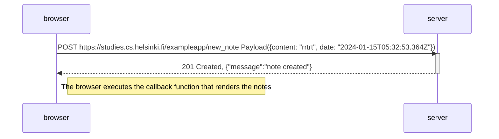

```mermaid
sequenceDiagram
    participant browser
    participant server

    browser->>server: POST https://studies.cs.helsinki.fi/exampleapp/new_note Payload({content: "rrtrt", date: "2024-01-15T05:32:53.364Z"})
    activate server
    server-->>browser: 201 Created, {"message":"note created"}


    deactivate server


    Note right of browser: The browser executes the callback function that renders the notes
```